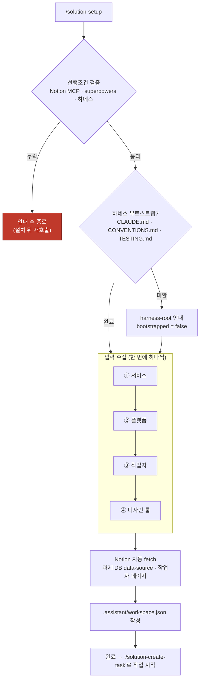
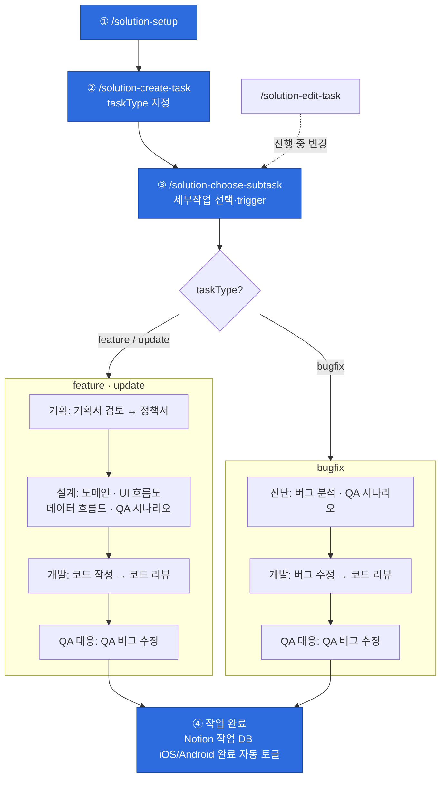

# solution-assistant

> 솔루션개발부 업무 보조 플러그인. 5개 서비스(달라 · 클럽라이브 · 여보야 · 클럽5678 · AI식단) × iOS/Android × feature/update/bugfix. 과제 하나의 전 과정(기획서 검토 → 코드 → 리뷰 → QA → 종결)을 세부작업 단위로 안내하고 산출물을 Notion에 축적한다.

## 설치

**1. 선행조건 (필수)** — 없으면 `/solution-setup`이 차단한다.

- **Notion MCP** (`notion-*`) — 산출물 본문 저장소 + 과제 DB
- **superpowers 플러그인** — brainstorming · writing-plans 등 프로세스 스킬
- **하네스 플러그인** (`solution-harness`) — write-code가 코드 구현을 위임하는 `work` 엔진

> 디자인 툴(Figma/Zeplin)은 선택 연동이다(차단하지 않음).

**2. 마켓플레이스 등록 → 설치**

```bash
/plugin marketplace add <이 저장소 경로 또는 git URL>
/plugin install solution-assistant@solution-marketplace
```

**3. Project Scope로 설치** — 과제별 로컬 상태(`.assistant/`)와 repo 하네스 문서를 대상으로 동작하므로 **관리 대상 repo에 project scope로 설치**한다. 설치 후 `/solution-setup`을 먼저 실행한다.

## 용어

- **task (과제)** — 개발 단위 하나(예: `DCL-1234`). `.assistant/<과제번호>/task.json`이 메타데이터를 캐시하고, 권위 출처는 Notion 과제 row. 병렬 과제 허용.
- **subtask (세부작업)** — 과제를 진행하는 개별 작업. 진행 상태·선행조건·순서 개념 없이 자유 선택된다(일부 하드 게이트 제외). 완료 판정은 `task.json.links`의 키 존재 여부로만. 목록은 작업 유형별로 다르다.

## 프로젝트 초기설정

`/solution-setup`으로 워크스페이스를 초기화한다. 3대 선행조건(Notion MCP · superpowers · 하네스)을 검증하고, 서비스 · 플랫폼(iOS/Android) · 작업자 · Notion 과제 DB를 수집해 `.assistant/workspace.json`에 기록하며, 현재 repo의 하네스 부트스트랩(루트 문서 존재)을 확인한다. 다른 스킬을 쓰기 전 **반드시 먼저 실행**한다.



## 작업 유형

| 유형 | 라벨 | 구성 |
|---|---|---|
| **feature** | 신규 개발 | 기획 → 설계 → 개발 → QA 대응 → 종결 |
| **update** | 변경/고도화 | feature와 동일 구성, 문서 스킬 라벨만 "수정" |
| **bugfix** | 버그 수정 | 진단 → 개발 → QA 대응 → 종결 (기획·설계 없음) |

## 기능

직접 호출 가능한 진입점은 5개다. 세부작업(과제 종결 등)은 `/solution-choose-subtask`이 trigger한다.

| 기능 | 호출 |
|---|---|
| 프로젝트 설정 | `/solution-setup` |
| 작업 생성 | `/solution-create-task <과제번호>` |
| 작업 진행 (세부작업 선택·trigger) | `/solution-choose-subtask` |
| 진행 중 변경 전파 | `/solution-edit-task` |
| 마찰 로그 분석 (보조) | `/solution-insights` |

> **작업 완료**는 `/solution-choose-subtask` → **과제 종결** 세부작업으로 진행한다.

**진입 하드 게이트** (choose-subtask이 trigger 직전 검사):

- feature `코드 작성` — 정책서 · UI 흐름도 · 데이터 흐름도가 모두 있어야 진입
- `코드 리뷰` — `codeWriteDone` 필요 · `과제 종결` — `codeReviewDone` 필요

## 전체 흐름



## 노션 산출물

| 세부작업 | 스킬 키 | Notion 산출물 | 형태 | taskType |
|---|---|---|---|---|
| 기획서 검토 | `write-policy-feedback` | `기획서 검토 - <버전>` | 페이지 (버전마다 누적) | feature · update |
| 정책서 | `write-policy` | `정책서` | 단일 페이지 | feature · update |
| 도메인 명세서 | `write-domain` | `도메인 명세서` | 단일 페이지 | feature · update |
| UI 흐름도 | `draw-ui-flow` | `UI 흐름도` | 단일 페이지 | feature · update |
| 데이터 흐름도 | `draw-data-flow` | `데이터 흐름도` + `통신 명세서` | 다중 페이지 | feature · update |
| 버그 분석 | `analyze-bug` | `버그 분석` | 단일 페이지 | bugfix |
| QA 시나리오 | `write-qa` | `QA 시나리오` | 데이터베이스 (행 = 테스트 케이스) | 전체 |

> 문서 스킬은 진입 시 `sync-links`로 `task.json.links`를 Notion 과제 row 자식 페이지와 동기화한다. 스키마·상수 정본: [`references/state-schema.md`](references/state-schema.md), [`hooks/lib/constants.json`](hooks/lib/constants.json).
