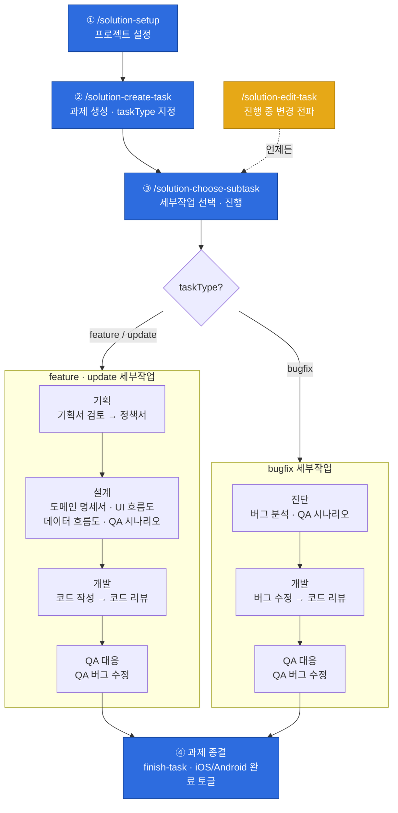

# solution-assistant

> 솔루션개발부 개발 파이프라인 플러그인 — 5개 서비스(달라 · 클럽라이브 · 여보야 · 클럽5678 · AI식단) × 2 플랫폼(iOS · Android) × 3 작업 유형(feature · update · bugfix)의 개발 어시스턴트. 기획서 검토부터 코드 작성 · 리뷰 · QA · 종결까지, 과제 하나의 전 과정을 세부작업 단위로 안내하고 산출물을 Notion에 축적한다.

---

## 설치

### 1. MCP · 플러그인 연동 (필수)

`/solution-setup`은 아래 3개 선행조건이 모두 갖춰져야 통과한다. 하나라도 없으면 **차단**된다.

| 선행조건 | 용도 |
|---|---|
| **Notion MCP** (`notion-*` 도구군) | 모든 산출물(정책서 · 흐름도 · QA 등)의 본문 저장소이자 과제 DB |
| **superpowers 플러그인** | brainstorming · writing-plans · executing-plans 등 프로세스 스킬 |
| **하네스 플러그인** (`work` 닫힌 루프 + `harness-root`/`harness-module`/`harness-check`/`harness-update`) | 코드 구현 위임 엔진 — write-code가 코드 생성을 `work`에 하드 의존 |

> **디자인 툴(Figma/Zeplin)** 연동은 **선택**이다. setup이 서비스별로 사용 툴을 물어 기록하지만 하드 차단하지 않는다.

### 2. 마켓플레이스 등록 → 플러그인 설치

Claude Code 터미널에서 이 저장소를 마켓플레이스로 추가한 뒤 플러그인을 설치한다.

```bash
# 마켓플레이스 등록 (이 저장소 경로 또는 원격 repo)
/plugin marketplace add <이 저장소 경로 또는 git URL>

# 플러그인 설치
/plugin install solution-assistant@solution-marketplace
```

> 마켓플레이스에는 `solution-assistant`와 의존 대상인 `solution-harness`가 함께 카탈로그되어 있다.

### 3. Project Scope로 설치

이 플러그인은 **과제별 로컬 상태**(`.assistant/`)와 **repo 하네스 문서**(`CLAUDE.md`, `docs/CONVENTIONS.md`, `docs/rules/TESTING.md`)를 대상으로 동작한다. 따라서 **관리 대상 repo에 project scope로 설치**해야 팀과 설정을 공유하고 그 repo에 한정해 활성화된다. (user scope 전역 설치는 권장하지 않는다.)

설치 후 **반드시 `/solution-setup`을 먼저 실행**해야 다른 스킬을 쓸 수 있다. setup은 선행조건 검증에 더해 현재 repo의 하네스 **부트스트랩**(루트 문서 존재)을 확인해 `workspace.json.harness.bootstrapped`에 기록한다.

---

## 용어

### task (과제)
개발 단위 하나. 지라 과제번호(예: `DCL-1234`)로 식별한다. 로컬 `.assistant/<과제번호>/task.json`이 메타데이터(작업 유형, Notion 문서 링크 캐시, 코드 진행 플래그)를 보관하고, 권위 출처는 Notion 과제 DB row다. 병렬 과제는 항상 허용된다.

### subtask (세부작업)
과제를 진행하기 위해 수행하는 개별 작업(정책서 작성, UI 흐름도, 코드 작성, 코드 리뷰 …). **진행 상태·선행조건·파이프라인 개념이 없다** — 순서 없이 자유 선택된다(일부 하드 게이트 제외). "실행됨" 판정은 `task.json.links`에 해당 키가 존재하는지 여부로만 한다. 세부작업 목록은 **작업 유형별로 다르게** 구성된다.

---

## 작업 유형 (taskType)

과제 생성 시 **명시적으로 지정**한다(추론하지 않음). 유형에 따라 세부작업 메뉴 구성과 라벨이 갈린다.

| 유형 | 라벨 | 세부작업 구성 |
|---|---|---|
| **feature** | 신규 개발 | 기획 → 설계 → 개발 → QA 대응 → 종결 (10개, 라벨 = "작성") |
| **update** | 변경/고도화 | feature와 동일 구성, 문서 스킬 라벨만 "수정" — 이전 Notion 문서 복사 수정(분기 A) 또는 코드베이스 기반 산출(분기 B) |
| **bugfix** | 버그 수정 | 진단 → 개발 → QA 대응 → 종결 (6개, 기획·설계 없이 버그 분석부터) |

---

## 기능

플러그인의 사용자 라이프사이클은 아래 흐름을 따른다. **슬래시 명령으로 직접 호출되는 진입점은 `setup` · `create-task` · `choose-subtask` · `edit-task` · `insights` 5개**이며, `finish-task`를 포함한 나머지 세부작업은 모두 `choose-subtask`가 trigger한다(직접 호출 불가).

| 단계 | 기능 | 스킬 | 호출 방법 |
|---|---|---|---|
| ① | **프로젝트 설정** | `solution-setup` | `/solution-setup` |
| ② | **작업 생성** | `solution-create-task` | `/solution-create-task <과제번호>` |
| ③ | **작업 진행** | `solution-choose-subtask` | `/solution-choose-subtask` |
| ④ | **작업 진행 중 수정** | `solution-edit-task` | `/solution-edit-task` |
| ⑤ | **작업 완료** | `solution-finish-task` | `/solution-choose-subtask` → **과제 종결** 선택 |

- **① 프로젝트 설정** — 3대 선행조건 검증, 서비스/플랫폼/작업자/Notion 설정 수집, `.assistant/workspace.json` 작성, 하네스 부트스트랩 확인.
- **② 작업 생성** — 작업 유형을 명시적으로 묻고 `.assistant/<과제번호>/task.json`을 `links: {}`로 생성, Notion 과제 DB row 등록/갱신.
- **③ 작업 진행** — `.assistant/`의 과제를 스캔해 하나를 고르고, 작업 유형별 세부작업 메뉴(그룹별)를 보여준 뒤 선택한 세부작업 스킬을 trigger. 진입 게이트(아래 참조)를 포함한다.
- **④ 작업 진행 중 수정** — 진행 중 과제(activeTask)에 정책·흐름·명세 변경이 생기면 영향 범위를 판단해 확정받고, 영향 문서를 의존 순서로 기존 문서 스킬에 재trigger해 갱신하며, 코드가 영향받으면 write-code 경유 재작성을 위임한다(변경 전파 오케스트레이터).
- **⑤ 작업 완료** — 커밋 패턴 준수 검증, 산출물 존재 보고, 과제 DB row의 `iOS_완료`/`Android_완료` 토글, 종결 보고서 출력.

> **보조 도구** — `/solution-insights`: `.assistant/improvement-log.jsonl`(어시스턴트 마찰 로그)을 집계해 HTML 대시보드를 만드는 독립 분석 도구. 세부작업 흐름 밖에 있다.

### 진입 하드 게이트

`choose-subtask`이 세부작업 trigger 직전에 검사한다.

- **write-code (feature)** — `sync-links` 후 필수 문서 집합(**정책서 · UI 흐름도 · 데이터 흐름도**)이 하나라도 없으면 **하드 블록**. update/bugfix는 경고 후 진행 가능.
- **review-code** — `task.json.codeWriteDone === true`일 때만 실행(코드 작성/수정 완료 전 리뷰 차단).
- **finish-task** — `task.json.codeReviewDone === true`일 때만 실행(코드 리뷰 완료 전 종결 차단).

---

## 전체 흐름



> **게이트 요약** — feature의 `코드 작성`은 정책서·UI 흐름도·데이터 흐름도가 모두 있어야 진입(하드), `코드 리뷰`는 `codeWriteDone`, `과제 종결`은 `codeReviewDone`이 참일 때만 진입. 그 외 세부작업엔 선행조건이 없어 자유 선택된다.

---

## 노션 산출물

세부작업이 Notion에 남기는 산출물의 관계다. `task.json.links[<키>]`에 pageId가 캐시되고, 권위 출처는 Notion 과제 row의 자식 페이지다. 코드 세부작업은 Notion 산출물이 없어 boolean 플래그로 완료를 표시한다.

| 세부작업(라벨) | 스킬 키 | Notion 산출물 | 형태 | taskType |
|---|---|---|---|---|
| 기획서 검토 | `write-policy-feedback` | `기획서 검토 - <버전>` | 페이지 (버전마다 누적) | feature · update |
| 정책서 (작성/수정) | `write-policy` | `정책서` | 단일 페이지 | feature · update |
| 도메인 명세서 | `write-domain` | `도메인 명세서` | 단일 페이지 | feature · update |
| UI 흐름도 | `draw-ui-flow` | `UI 흐름도` | 단일 페이지 | feature · update |
| 데이터 흐름도 | `draw-data-flow` | `데이터 흐름도` + `통신 명세서` | 다중 페이지 | feature · update |
| 버그 분석 | `analyze-bug` | `버그 분석` | 단일 페이지 | bugfix |
| QA 시나리오 | `write-qa` | `QA 시나리오` | 데이터베이스 (행 = 테스트 케이스) | 전체 |
| 코드 작성 (수정) | `write-code` | — (하네스 `work` 위임) | 산출물 없음 · `codeWriteDone` 플래그 | feature · update |
| 버그 수정 | `fix-bug` | — (git commit) | 산출물 없음 · `codeWriteDone` 플래그 | bugfix |
| 코드 리뷰 | `review-code` | (선택) 리뷰 페이지 | 선택 게시 · `codeReviewDone` 플래그 | 전체 |
| QA 버그 수정 | `fix-qa-bug` | — (git commit) | 산출물 없음 · 회귀 패치 | 전체 |
| 과제 종결 | `finish-task` | — (종결 보고서) | 산출물 없음 · `iOS_완료`/`Android_완료` 토글 | 전체 |

> 문서 세부작업 스킬은 진입 시 `sync-links`로 `task.json.links`를 Notion 과제 row 자식 페이지와 동기화한다(매칭·쓰기는 결정적 node `hooks/lib/sync-links.js`가 수행).

---

## SOT(단일 출처) 분리

| 데이터 | 저장소 |
|---|---|
| 과제 메타데이터 + Notion 문서 링크 캐시 | 로컬 `.assistant/<과제번호>/task.json` (권위 출처 = Notion 과제 row) |
| 코드 과제 계획서 | 로컬 `.assistant/<과제번호>/plan.md` (하네스 `work` 입력) |
| 코드 구현 진행/검증 상태 | 하네스 `.harness/runs/run-{id}.md` (`work` 소유, gitignore) |
| 산출물 본문 (정책서 · 흐름도 · QA 등) | Notion |
| 워크스페이스 설정 | 로컬 `.assistant/workspace.json` |
| 어시스턴트 마찰(불편) 기록 | 로컬 `.assistant/improvement-log.jsonl` (gitignore, `/solution-insights`가 소비) |

---

## 개발 · 테스트

`hooks/lib`의 결정적 node 로직(sync-links · notion · work · swagger-extract · hook-runtime 등)과 산출물 템플릿에 테스트가 있다. `package.json`은 없고 node 내장 러너로 실행한다.

```bash
node --test hooks/tests/*.test.js   # 전체 실행 (glob 필수 — 디렉터리형은 파일을 못 잡음)
```

상태 파일 스키마 · 세부작업 키/라벨 매핑의 단일 출처는 [`references/state-schema.md`](references/state-schema.md), 런타임 상수는 [`hooks/lib/constants.json`](hooks/lib/constants.json)이다. 스킬 본문에 중복 정의하지 않는다.
